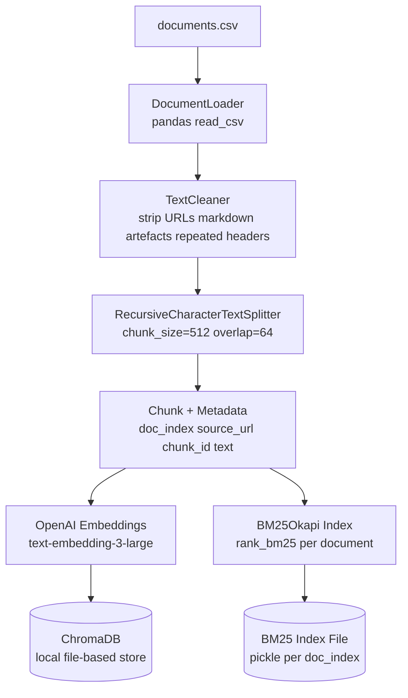
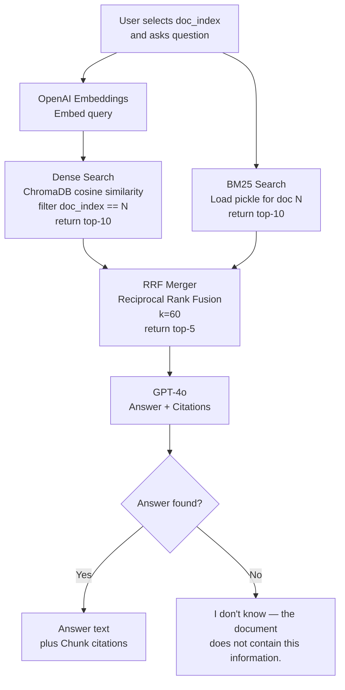

# DESIGN.md — Ask the Document: A Q&A Bot That Cites Its Sources

**Course:** Month 2 · LLMs, Prompt Engineering and RAG — Week 7 Project
**Author:** [Your Name]
**Date:** 2026-10-06

---

## 1. Architecture

### Ingest Flow



**Component descriptions:**
- **DocumentLoader** — reads `documents.csv` with pandas; yields one document per row.
- **TextCleaner** — strips raw URLs, collapses duplicate whitespace, removes markdown heading markers.
- **RecursiveCharacterTextSplitter** — splits on `\n\n → \n → space` hierarchy; 512-token chunks with 64-token overlap.
- **Chunk + Metadata** — each chunk carries `doc_index`, `source_url`, `chunk_id` (e.g. `"3_7"`) and the raw `text`.
- **OpenAI Embeddings** — calls `text-embedding-3-large`; batched 100 at a time to stay within rate limits.
- **ChromaDB** — single local collection (`ask_the_doc`); filter by `doc_index` at query time.
- **BM25Okapi Index** — one index per document, saved as a pickle file in `data/bm25/`.

### Question Flow



**Component descriptions:**
- **Dense Search** — cosine similarity in ChromaDB with `where={"doc_index": N}`; top-10 results.
- **BM25 Search** — tokenises query, scores all chunks in the document pickle; top-10 results.
- **RRF Merger** — merges two ranked lists; score = Σ 1/(60 + rank_i); deduplicates by `chunk_id`; returns top-5.
- **GPT-4o** — receives system prompt + 5 numbered passages; generates answer with `[Chunk N]` citations.

---

## 2. Ingestion and Chunking

### Loading
```python
df = pd.read_csv("data/documents.csv")   # columns: index, source_url, text
```

### Cleaning steps
1. Strip bare URLs (`https?://\S+`).
2. Replace `\r\n` with `\n`.
3. Collapse 3+ blank lines to 2.
4. Remove markdown heading markers (`##`, `###`, etc.) while keeping the heading text.

### Splitting
| Parameter | Value | Rationale |
|-----------|-------|-----------|
| `chunk_size` | 512 tokens | Covers most single-passage answers; small enough for precise citation |
| `chunk_overlap` | 64 tokens | Prevents answer from being cut at a chunk boundary |
| `length_function` | `tiktoken` `cl100k_base` | Matches the tokenizer used by `text-embedding-3-large` and GPT-4o |
| Separators | `["\n\n", "\n", " ", ""]` | Prefers paragraph boundaries |

### Chunk size experiment
Run `eval/chunk_experiment.py` on the dev set (docs 0–9) with sizes 256, 512, 1024:
- Measure citation correctness on `qa_single.csv` (gold passage must fit inside one chunk).
- Expected winner: 512 (best balance of precision and passage coverage).

### Metadata stored on each chunk
```python
{
    "doc_index": int,        # which of the 20 documents
    "source_url": str,       # original URL from documents.csv
    "chunk_id": str,         # "{doc_index}_{chunk_number}"  e.g. "3_7"
    "text": str              # raw chunk text (also stored as document body in ChromaDB)
}
```

---

## 3. Embeddings and Vector Store

### Chosen: OpenAI `text-embedding-3-large`

| Property | Value |
|----------|-------|
| Dimensions | 3072 (can reduce to 1536 with Matryoshka) |
| Context window | 8191 tokens |
| Benchmark (MTEB) | Top-3 overall; best on retrieval tasks |
| Cost | ~\$0.13 / 1M tokens |
| Why chosen | Highest recall on niche/technical text; same API as GPT-4o (one dependency) |

### Alternative considered: `BAAI/bge-large-en-v1.5` (local HuggingFace)
- Pros: free, no API call, competitive on MTEB.
- **Rejected because:** requires a local GPU or slow CPU inference; adds `torch` and `transformers` as heavyweight dependencies; harder to set up in under 10 minutes (README requirement).

### Chosen vector store: ChromaDB

| Property | Value |
|----------|-------|
| Storage | Local disk (`data/chroma/`) |
| Filtering | `where={"doc_index": N}` at query time |
| Setup | `pip install chromadb` — no Docker, no server |
| Why chosen | Zero-config for local development; sufficient for 20 documents and ~1,000 chunks |

### Alternative considered: Qdrant
- Pros: native hybrid search (sparse + dense in one query), production-grade, better at scale.
- **Rejected for now:** requires Docker or a cloud account; adds friction to the "runs in under 10 minutes" requirement. Can be swapped in later by changing `src/vectorstore.py`.

---

## 4. Retrieval

### Scope filtering
Every ChromaDB query includes `where={"doc_index": N}` so results never cross document boundaries.

### Value of k
- Dense search: **k = 10** (wider net before merging).
- BM25 search: **k = 10**.
- After RRF merge: **top-5 chunks** passed to GPT-4o.
- Rationale: 5 chunks × ~512 tokens = ~2,560 tokens of context — well within GPT-4o's 128k window, and enough to cover multi-passage answers.

### Baseline method
Dense-only: embed query → ChromaDB cosine search (filtered) → top-5 → GPT-4o.

### Improvement: Hybrid Search with RRF

```python
def reciprocal_rank_fusion(dense_results, bm25_results, k=60):
    scores = {}
    for rank, chunk in enumerate(dense_results):
        scores[chunk.chunk_id] = scores.get(chunk.chunk_id, 0) + 1 / (k + rank + 1)
    for rank, chunk in enumerate(bm25_results):
        scores[chunk.chunk_id] = scores.get(chunk.chunk_id, 0) + 1 / (k + rank + 1)
    ranked = sorted(scores, key=scores.get, reverse=True)
    return ranked[:5]
```

The improvement **plugs in between** the two search calls and the LLM call — the chain code is unchanged.

---

## 5. Prompt

### System prompt
```
You are a precise document assistant. You MUST follow these rules without exception:

1. Answer ONLY using the numbered passages provided below.
2. Do NOT use any knowledge from your training data.
3. Cite every passage you use with its number in square brackets, e.g. [Chunk 1].
4. If the passages do not contain the answer, respond with EXACTLY:
   "I don't know — the document does not contain this information."
5. Do not speculate, infer beyond the text, or combine information from outside the passages.
```

### User message format
```
Document: {source_url}

Passages:
[Chunk 1] {chunk_1_text}
[Chunk 2] {chunk_2_text}
...
[Chunk 5] {chunk_5_text}

Question: {user_question}
```

### Citation format
Each citation appears inline: `[Chunk 3]` or `[Chunk 1][Chunk 4]` at the end of the relevant sentence.

### Refusal rule and exact wording
- **Trigger:** All 5 chunks score below cosine threshold of 0.30 *or* GPT-4o cannot form an answer from the passages.
- **Exact wording (enforced in system prompt):**
  > "I don't know — the document does not contain this information."
- This exact string is checked in the evaluation script (`"I don't know"` substring match).

---

## 6. Evaluation

### Metrics

| Metric | Measurement method |
|--------|-------------------|
| **Answer accuracy** | GPT-4o-mini judge: given gold answer + bot answer, outputs `correct` / `partially_correct` / `incorrect`. Score = (correct + 0.5 × partial) / total |
| **Refusal rate** | On `qa_none.csv` dev questions: % where bot response contains `"I don't know"` (exact substring) |
| **Citation correctness** | For each cited chunk, check if the gold passage text has ≥ 50% token overlap with the chunk text (computed with `SequenceMatcher`) |

### Comparison protocol
1. Run `eval/evaluate.py --method baseline` → saves `eval/results/baseline.json`.
2. Run `eval/evaluate.py --method hybrid` → saves `eval/results/hybrid.json`.
3. `eval/compare.py` prints a side-by-side table and reports p-value (Fisher's exact test for refusal rate).

### LLM judge prompt (accuracy)
```
Gold answer: {gold_answer}
Bot answer: {bot_answer}

Is the bot answer correct, partially correct, or incorrect relative to the gold answer?
Reply with one word: correct / partially_correct / incorrect
```

---

## 7. Failure Handling

| Failure mode | Handling |
|-------------|---------|
| Retrieval returns 0 chunks (doc not yet ingested or filter error) | Raise `DocumentNotIngestedError` with message: "Document {N} has not been ingested. Run `python src/ingest.py` first." |
| Document is very long (> 200 chunks) | `ingest.py` warns and caps at 200 chunks; remaining text is skipped and logged to `data/skipped.log` |
| OpenAI API rate-limit (429) | Exponential backoff: 1s → 2s → 4s → 8s → fail with clear error |
| OpenAI API key missing | Startup check in `config.py`: raises `ValueError("OPENAI_API_KEY not set. Add it to .env.")` |
| GPT-4o returns no citation brackets | Post-processing step strips uncited answers and asks GPT-4o to re-cite (one retry) |
| BM25 pickle missing (first run) | `retrieval.py` detects missing pickle → calls `ingest.py` to rebuild → continues |

---

## 8. Repository Layout

```
ask-the-doc/
├── PROPOSAL.md
├── DESIGN.md
├── REPORT.md               # filled after build
├── README.md
├── requirements.txt
├── .env.example            # OPENAI_API_KEY=sk-...
│
├── data/
│   ├── documents.csv
│   ├── qa_single.csv
│   ├── qa_multi.csv
│   ├── qa_none.csv
│   ├── chroma/             # ChromaDB files (auto-created)
│   └── bm25/               # BM25 pickle files (auto-created)
│       ├── bm25_0.pkl
│       └── ...
│
├── src/
│   ├── config.py           # chunk_size, k, model names, paths
│   ├── ingest.py           # load → clean → chunk → embed → store + BM25
│   ├── retrieval.py        # dense search, BM25 search, RRF merge
│   ├── chain.py            # build prompt → call GPT-4o → parse citations
│   └── bm25_index.py       # BM25Okapi wrapper, save/load pickle
│
├── eval/
│   ├── evaluate.py         # run dev questions, compute metrics, save JSON
│   ├── compare.py          # baseline vs hybrid side-by-side table
│   ├── chunk_experiment.py # test chunk sizes 256/512/1024
│   └── results/
│       ├── baseline.json
│       └── hybrid.json
│
└── app.py                  # CLI: python app.py --doc 3 --question "..."
```

### Key commands (from README)
```bash
# 1. Install
pip install -r requirements.txt

# 2. Set API key
cp .env.example .env   # add your key

# 3. Ingest all 20 documents
python src/ingest.py

# 4. Ask a question
python app.py --doc 3 --question "What is the maximum stack size?"

# 5. Evaluate baseline
python eval/evaluate.py --method baseline

# 6. Evaluate hybrid
python eval/evaluate.py --method hybrid

# 7. Compare results
python eval/compare.py
```

---

## 9. Changes from Design

*Empty at submission of DESIGN.md. Will be updated during the build phase to record any deviations from this design, including the reason for each change.*
