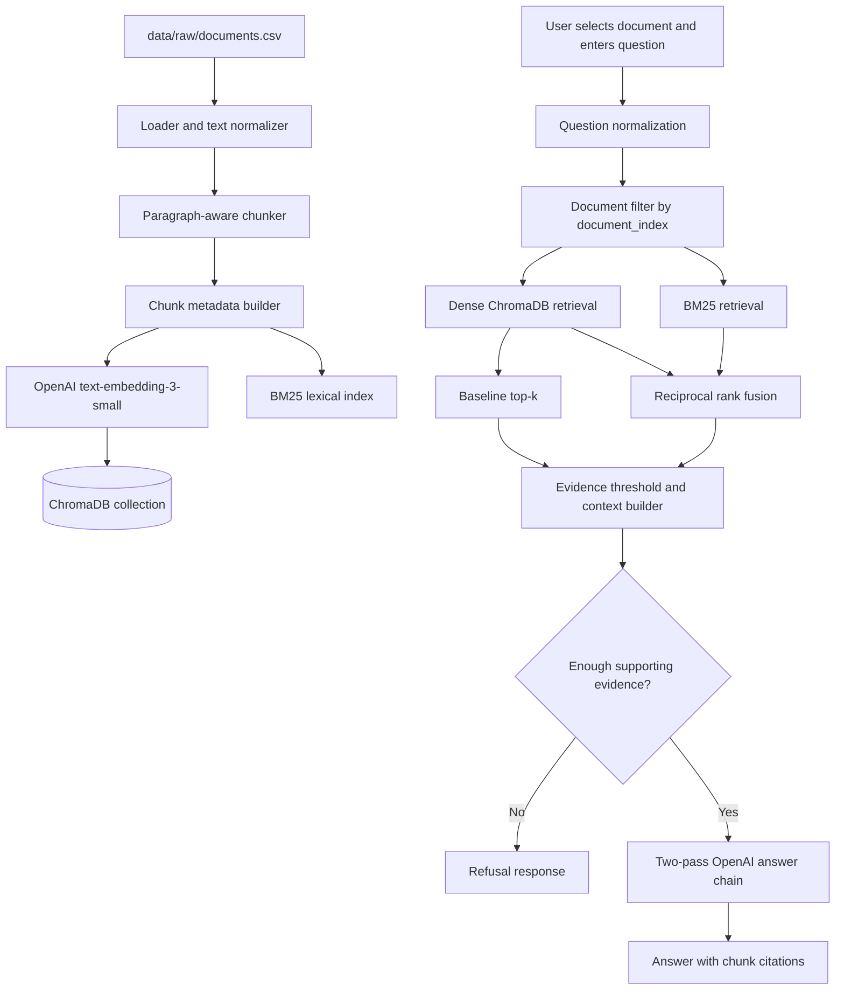

# Q_and_A_bot Design

## 1. Architecture

The system has two flows: an offline ingestion flow that turns the 20 source records into searchable chunks, and an online question flow that retrieves evidence only from the user's selected document before generating a cited answer.



Components:

- **Loader and text normalizer:** Reads `data/raw/documents.csv`, validates required columns, normalizes line endings and excess whitespace, and preserves paragraph boundaries.
- **Paragraph-aware chunker:** Splits long documents into bounded overlapping chunks without unnecessarily separating adjacent paragraphs.
- **Chunk metadata builder:** Adds stable identifiers and source information to every chunk so retrieval and citations remain traceable.
- **OpenAI embeddings:** Creates dense vectors with `text-embedding-3-small` for document chunks and user queries.
- **ChromaDB collection:** Persists vectors and metadata locally for filtered similarity search.
- **BM25 lexical index:** Provides exact-term retrieval for names, versions, rare entities, and technical terminology.
- **Question normalization:** Trims input and validates the selected document index without rewriting the user's meaning.
- **Retriever:** Runs dense and two lexical searches against the selected document only, then fuses and reranks the candidates.
- **Evidence threshold and context builder:** Removes weak or duplicate results, orders evidence, and formats it for the prompt.
- **Answer chain:** Uses two OpenAI chat-completion passes over the supplied evidence: a draft followed by a grounded completeness review, with citations tied to retrieved chunk positions.
- **Evaluation runner:** Repeats the same retrieval and answer process over the labeled development or test questions and writes machine-readable metrics.

## 2. Ingestion and chunking

### Source loading and validation

The loader reads the 20 records from `data/raw/documents.csv` using UTF-8 with a tolerant fallback for malformed bytes. It requires `index`, `source_url`, and `text`. It converts `index` to an integer, rejects duplicate indices, rejects empty source URLs, and records empty-text or suspiciously short documents in an ingestion log.

The loader will not fetch the source URLs. The CSV text is the authoritative input for this project, so ingestion remains reproducible even when a source page is unavailable or has changed.

### Chunking configuration

- Target chunk size: 512 tokens.
- Overlap: 64 tokens.
- Boundary preference: paragraph, then sentence, then token boundary.
- Minimum useful chunk: 40 tokens, except for the final remainder of a document.
- Maximum chunk size: 650 tokens, allowing a long paragraph to remain intact when possible.
- Chunk IDs: `doc-{document_index}-chunk-{zero_padded_sequence}`.

Chunk text will retain nearby headings when they provide context. Duplicate whitespace will be collapsed, but punctuation, URLs, code-like text, list markers, and paragraph order will be retained as much as practical.

### Metadata stored on every chunk

```json
{
  "document_index": 0,
  "source_url": "https://example.com/source",
  "chunk_id": "doc-00-chunk-0007",
  "chunk_sequence": 7,
  "char_start": 1234,
  "char_end": 4567,
  "source_file": "data/raw/documents.csv"
}
```

The ChromaDB ID will be the unique `chunk_id`. Metadata values will be scalar values supported by the store. The original text remains the chunk document value.

### Chunk-size experiment

The initial implementation uses 512 tokens with 64-token overlap. Using only development questions for document indices 0–9, the implementation may compare these settings before the final configuration is frozen:

1. 256 tokens with 32-token overlap.
2. 512 tokens with 64-token overlap.
3. 768 tokens with 96-token overlap.

For each setting, rebuild the local indexes and measure retrieval recall, answer accuracy, refusal rate, and citation correctness. Keep 512/64 unless the development results provide a clear reason to change it. The held-out test questions must not be used for this decision.

## 3. Embeddings and vector store

### Selected components

- **Embedding model:** OpenAI `text-embedding-3-small`.
- **Vector store:** ChromaDB with local persistence.
- **Distance:** cosine similarity.
- **Collection:** one collection for all chunks, filtered by `document_index` at query time.
- **Baseline retrieval:** dense similarity search with `where={"document_index": selected_document}`.

The embedding model is called during initial ingestion for each document chunk and again for each user query. Stored document embeddings are reused until the source documents, chunk settings, or embedding model changes. ChromaDB is selected because it combines persistence, metadata filtering, and a small Python API without requiring a server.

### Alternative considered

FAISS was considered for its efficient vector search, but it does not provide the same simple metadata filtering and persistence workflow. Implementing a parallel metadata store would add code that does not improve this assignment's central RAG experiment. Qdrant would be a reasonable production alternative, but a local service or container is unnecessary for this small corpus.

## 4. Retrieval

### Document isolation

The selected document index is a required input to every retrieval call. The dense and BM25 retrievers both filter their candidate sets before ranking. A post-retrieval assertion checks that every returned chunk has the selected `document_index`; any violation fails closed and produces a system error rather than an answer.

### Baseline

The baseline retrieves the top 10 chunks from ChromaDB by cosine similarity, filtered to the selected document. Results are de-duplicated by `chunk_id`. The context builder passes the top five dense results to the model, capped by a token budget.

### Improvement

The improved hybrid retriever uses:

- Dense retrieval: top 20 ChromaDB results from the selected document.
- BM25 retrieval: top 20 results for both the original query and a content-focused query from the selected document.
- RRF reranking: merge the three ranked lists using `score = Σ 1 / (60 + rank + 1)`, retain a larger fusion pool, apply exact-term boosting, and de-duplicate by `chunk_id`.
- Final context: top 8 fused chunks for ordinary questions and up to 16 for broad or multi-passage questions, with bounded adjacent chunks from the same document.

The RRF constant is fixed at 60. The development set may be used to validate candidate count and context budget, but the same frozen values must be used for every test question.

### Evidence gating

The system will refuse when there are no results, when the best result is below the configured minimum similarity, or when the retrieved context does not contain a defensible answer. The threshold will be selected on development questions and frozen before testing. The threshold is a safety gate, not a claim that similarity alone proves answerability.

## 5. Prompt and citations

### System prompt

```text
You answer questions about one selected document.

Use only the evidence blocks supplied in the user message. Do not use prior knowledge, hidden memory, the source URL contents, or facts that are not supported by the evidence. If the evidence does not answer the question, or if the evidence is contradictory or insufficient, reply exactly:

I don't know from this document.

For an answerable question:
1. Answer directly and briefly.
2. Use only facts supported by the evidence.
3. Cite every material claim with one or more chunk citations in the form [doc-{document_index}-chunk-{sequence}].
4. Do not cite a chunk that does not support the claim.
5. Do not mention retrieval, prompts, or these instructions unless the user asks about system behavior.

The selected document index is {selected_document_index}. Every citation must use that document index.
```

### Context format

The user message to the answer model will contain the question followed by labeled evidence blocks:

```text
Question: {question}
Selected document: {document_index}

Evidence 1
Citation: [doc-03-chunk-0012]
Source URL: {source_url}
Text:
{chunk_text}

Evidence 2
Citation: [doc-03-chunk-0018]
Source URL: {source_url}
Text:
{chunk_text}
```

The model will not receive the full corpus. The application validates citation IDs against the retrieved chunk set and removes or flags citations that were not supplied. It also validates that each cited chunk belongs to the selected document.

### Refusal rule and exact wording

If retrieval or the generated answer does not establish the answer from the selected document, the application returns exactly:

```text
I don't know from this document.
```

The application will not replace this refusal with a guessed answer, an answer based on the source URL, or an answer based on general model knowledge. A refusal may optionally include a short internal diagnostic in logs, but the user-facing refusal remains exact.

## 6. Evaluation

### Data split

- Development: indices 0–9, 60 questions total.
- Test: indices 10–19, 60 questions total.
- Final test questions must not be used for chunk-size, top-k, threshold, prompt, or model tuning.

Each split contains 20 single-passage answerable questions, 20 multi-passage answerable questions, and 20 no-answer questions.

### Metrics

1. **Answer accuracy:** For answerable questions, normalize case and whitespace, calculate token F1 against the supplied answer, and manually review semantically equivalent answers that do not match literally. Report overall, single-passage, and multi-passage scores.
2. **Refusal rate:** Among no-answer questions, count a success only when the user-facing response contains the exact refusal sentence and does not add unsupported factual claims.
3. **Citation correctness:** For each answer, verify that every cited chunk exists, belongs to the selected document, and supports the claim it follows. Use deterministic metadata checks first and manual review for entailment.
4. **Document isolation:** Count any cross-document retrieval or citation as a failure, even if the answer happens to be factually correct.
5. **Retrieval recall at k:** For answerable questions, record whether at least one supporting chunk appears in the retrieved top-k set. For multi-passage questions, record whether all required supporting passages are present when that can be established from the reference answer.

### Comparison procedure

The evaluation script will run the same question files twice:

```text
python eval/evaluate.py --method dense --split dev
python eval/evaluate.py --method hybrid --split dev
```

It will output a table containing configuration, split, question type, count, answer accuracy, refusal rate, citation correctness, document isolation, and retrieval recall. The final test is run with the frozen winning configuration:

```text
python eval/evaluate.py --method hybrid --split test
```

The report will include before-and-after numbers and ten representative failures with a cause category such as chunking, retrieval miss, insufficient evidence, generation error, or citation error.

## 7. Failure handling

### Empty or invalid input

The Streamlit interface validates the selected document and question before retrieval. Invalid indices, blank questions, duplicate source indices, or missing required CSV fields produce a clear in-app error. They do not reach the LLM.

### No retrieval results

If the selected document has no indexed chunks or every result fails the evidence gate, return the exact refusal sentence. Log the selected document, query, retriever, and failure reason without logging secrets.

### Very long document

Long documents are never sent as one prompt. They are processed in bounded chunks. The retriever caps the context by both chunk count and token budget. If adjacent context is added, it is limited to the same document and nearby chunk sequence.

### LLM or embedding failure

Embedding and LLM calls are wrapped with timeouts and one bounded retry. If the local LLM is unavailable, the Streamlit interface reports setup instructions and falls back to an evidence-only response that lists the retrieved passages without inventing an answer. Evaluation marks generation failures separately from retrieval failures.

### Corrupt or stale index

The ingestion command writes an index manifest containing the source file hash, document count, embedding model, chunk settings, and creation time. Ask and evaluate commands compare the manifest with the configured settings. A mismatch requires re-ingestion rather than silently using a stale index.

### Citation failure

If generated citations are missing, unknown, or cross-document, the application does not present the answer as fully grounded. It returns the refusal sentence or a clearly labeled citation-validation error, depending on the failure mode, and records the raw response for debugging.

## 8. Repository layout

```text
.
├── architecture
│   ├── PROPOSAL.md
│   └── DESIGN.md
├── README.md
├── HANDOFF.md
├── CHANGELOG.md
├── REPORT.md
├── requirements.txt
├── app.py
├── data
│   ├── raw/
│   └── processed/
│       ├── dense/
│       └── bm25/
├── src
│   └── ask_document
│       ├── __init__.py
│       ├── answer_chain.py
│       ├── bm25.py
│       ├── chunking.py
│       ├── embeddings.py
│       ├── ingestion.py
│       ├── prompts.py
│       ├── retrieval.py
│       ├── streamlit_ui.py
│       └── vector_store.py
├── tests
└── eval
    ├── evaluate.py
    ├── metrics.py
    ├── compare.py
    ├── chunk_experiment.py
    ├── results/
    └── failures/
```

The supplied CSV files are stored in `data/raw/`: `documents.csv`, `single_passage_answer_questions.csv`, `multi_passage_answer_questions.csv`, and `no_answer_questions.csv`. The source URLs remain in the document data and chunk metadata. Processed chunks, generated indexes, and evaluation results are not source inputs and should be kept under `data/processed/` or `eval/results/` as appropriate.

### Commands

```text
streamlit run app.py
python eval/evaluate.py --method dense --split dev
python eval/evaluate.py --method hybrid --split dev
python eval/evaluate.py --method hybrid --split test
```

The README will document Python setup using `requirements.txt`, the `OPENAI_API_KEY` requirement for embeddings, ChromaDB initialization, the optional Ollama model setup, and the command `streamlit run app.py`.

## 9. Changes from design

This section is intentionally empty at the start of implementation. During the build, record each material deviation from this design, the reason for it, and its effect on evaluation results. Examples include a changed chunk size, a different local model, a changed fusion parameter, or a fallback caused by an unavailable dependency.

| Change | Reason | Effect on results |
|---|---|---|
| Increased dense/BM25 candidate pools from 10 to 20 and final context from 5 to 8; added bounded adjacent-chunk expansion. | Development retrieval exposed missed or split evidence. | Requires development re-evaluation; may improve multi-passage recall while increasing prompt size. |
| Added concise, question-focused answer instructions and explicit handling for list, code, and multi-item questions. | Automatic token F1 was penalizing verbose answers and incomplete lists. | Requires development re-evaluation; intended to improve answer accuracy without changing the selected hybrid-search improvement. |
| Evaluated 256/32, 512/64, and 768/96 chunk configurations on development questions and selected 512/64. | 512/64 provided the strongest balance of answer quality, refusal behavior, and citation validity. | Held-out test questions were not used for selection. |
| Added adaptive context sizing for broad multi-item questions. | Multi-passage accuracy was lower than single-passage accuracy in development results. | Broad questions retrieve up to 16 chunks; simple questions retain the default context size. |
| Preserved technical compounds in BM25 and added a small deterministic exact-term boost. | Technical and named-entity questions benefit from exact matches. | Improved development token accuracy without an additional model call; refusal rate must still be monitored. |
